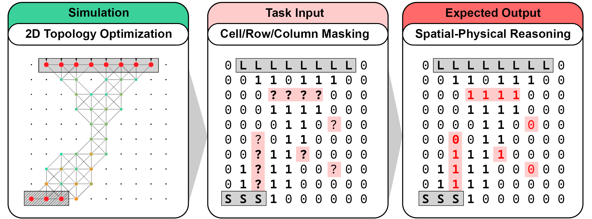

# 🧠 **SPhyR**

_A Spatial Physical Reasoning Benchmark_



## 🤗 SPhyR on HuggingFace

You can also explore or download the dataset directly from Hugging Face:

🔗 [SPhyR on Hugging Face](https://huggingface.co/datasets/anonymized/)

---

## 🔁 How to Re-Generate the Dataset

Follow these steps to recreate the dataset from scratch.

### 🛠️ Step 1: Installation

1. **Create a Conda Environment**  
   Make sure you have [Miniconda](https://docs.conda.io/en/latest/miniconda.html) or [Anaconda](https://www.anaconda.com/) installed.

   ```bash
   conda create -n "sphyr" python -y
   conda activate sphyr
   ```

2. **Install Poetry & Project Dependencies**  
   Poetry is used for dependency management.

   ```bash
   pip install poetry
   poetry install
   ```

### 🦏 Step 2: Rhinoceros 8.0 & Grasshopper Setup

1. **Download Rhinoceros 8.0**  
   Rhino includes the **Grasshopper** visual programming environment.  
   📥 [Download here](https://www.rhino3d.com/)

2. **Install Millipede Plugin**  
   Move the **Millipede plugin** to Grasshopper's special components folder:

   ```
   src/sphyr/dataset_creation/topology_optimization_data/2D/rhino_grasshopper/libraries/millipede
   ```

   You can access the special folder in Grasshopper via:  
   `File` > `Special Folders` > `Components Folder`

3. **Open the Rhino & Grasshopper Files**

   - Rhino File:  
     `src/sphyr/dataset_creation/topology_optimization_data/2D/rhino_grasshopper/SPhyR_2D.3dm`
   - Grasshopper Script:  
     `src/sphyr/dataset_creation/topology_optimization_data/2D/rhino_grasshopper/SPhyR_2D.gh`

   ✅ Once opened, run the Grasshopper script by toggling the boolean on the **top-left of the canvas**.

   💡 **Tip**: If you'd rather skip this step, precomputed results are available:

   - Raw Data: `src/sphyr/dataset_creation/topology_optimization_data/2D/raw_data`
   - Plots/Frames: `src/sphyr/dataset_creation/topology_optimization_data/2D/frames`

### 📦 Step 3: Convert to JSON (HuggingFace Dataset Format)

Run the following Python script to convert raw simulation output to a format suitable for evaluation on HuggingFace:

```bash
python src/sphyr/dataset_creation/raw_data_2D_to_huggingface_datasets.py
```

This script processes the `.csv` simulation outputs into structured `.json` entries.

---

## 📊 Additional Information

### 🧪 Results Overview

Benchmarks for 100 samples are available for the following models:

- **Claude 3.7 Sonnet**
- **Claude Opus 4**
- **DeepSeek-R1**
- **Gemini 1.5 Pro**
- **Gemini 2.5 Pro**
- **GPT-3.5 Turbo**
- **GPT-4.1**
- **GPT-4o**
- **Perplexity Sonar**
- **Perplexity Sonar Reasoning**

📁 You can find these results inside the `results` directory.

### 3D Topology Optimization Data

We have included a preliminary sub-set of 3D data and corresponding plots, but we plan to release a full set in the future. 3D Data can be found here: `src/sphyr/dataset_creation/topology_optimization_data/3D`.

---

## Citation

**BibTeX:**

WIP

**APA:**

WIP