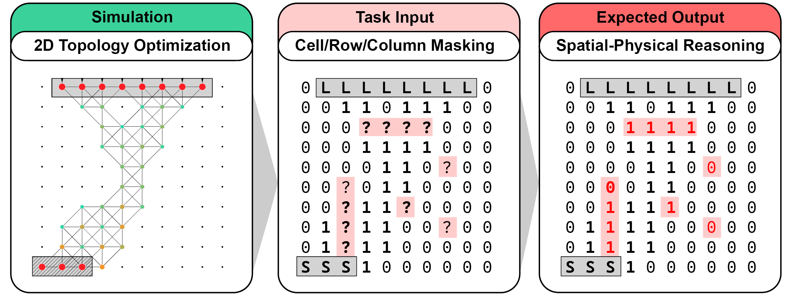

# 🧠 **SPhyR**

_A Spatial Physical Reasoning Benchmark_



## 🤗 SPhyR on HuggingFace

You can also explore or download the dataset directly from Hugging Face:

🔗 [SPhyR on Hugging Face](https://huggingface.co/datasets/anonymized/)

---

## 🔁 How to Re-Generate the Dataset

Follow these steps to recreate the dataset from scratch.

### 🛠️ Step 1: Installation

1. **Create a Conda Environment**  
   Make sure you have [Miniconda](https://docs.conda.io/en/latest/miniconda.html) or [Anaconda](https://www.anaconda.com/) installed.

   ```bash
   conda create -n "sphyr" python -y
   conda activate sphyr
   ```

2. **Install Poetry & Project Dependencies**  
   Poetry is used for dependency management.

   ```bash
   pip install poetry
   poetry install
   ```

### 🦏 Step 2: Rhinoceros 8.0 & Grasshopper Setup

1. **Download Rhinoceros 8.0**  
   Rhino includes the **Grasshopper** visual programming environment.  
   📥 [Download here](https://www.rhino3d.com/)

2. **Install Millipede Plugin**  
   Move the **Millipede plugin** to Grasshopper's special components folder:

   ```
   src/sphyr/dataset_creation/topology_optimization_data/2D/rhino_grasshopper/libraries/millipede
   ```

   You can access the special folder in Grasshopper via:  
   `File` > `Special Folders` > `Components Folder`

3. **Open the Rhino & Grasshopper Files**

   - Rhino File:  
     `src/sphyr/dataset_creation/topology_optimization_data/2D/rhino_grasshopper/SPhyR_2D.3dm`
   - Grasshopper Script:  
     `src/sphyr/dataset_creation/topology_optimization_data/2D/rhino_grasshopper/SPhyR_2D.gh`

   ✅ Once opened, run the Grasshopper script by toggling the boolean on the **top-left of the canvas**.

   💡 **Tip**: If you'd rather skip this step, precomputed results are available:

   - Raw Data: `src/sphyr/dataset_creation/topology_optimization_data/2D/raw_data`
   - Plots/Frames: `src/sphyr/dataset_creation/topology_optimization_data/2D/frames`

### 📦 Step 3: Convert to JSON (HuggingFace Dataset Format)

Run the following Python script to convert raw simulation output to a format suitable for evaluation on HuggingFace:

```bash
python src/sphyr/dataset_creation/raw_data_2D_to_huggingface_datasets.py
```

This script processes the `.csv` simulation outputs into structured `.json` entries.

---

## 🧮 Dynamic Evaluation (Topology Optimization in the Loop)

Comparing a completion to the reference answer cell by cell asks the wrong
question: a structure that routes the load differently but just as efficiently
is marked wrong, while one that matches almost everywhere but severs the load
path is marked nearly right. SPhyR therefore also evaluates completions
**dynamically** — by simulating them and re-running a real topology optimizer.

### How a completion is scored

1. **Rebuild the load case.** The `L`, `S` and density cells of the sample are
   turned into a plane-stress finite element model: a unit load spread over the
   load cells, the support cells clamped, one bilinear (Q4) element per grid
   cell, and stiffness interpolated from density with the SIMP law
   `E(ρ) = E_min + ρ^p (E_0 − E_min)`.
2. **Simulate the completion.** Solving `K u = f` gives its **compliance**
   (the work done by the load — the inverse of stiffness). A completion whose
   load path is broken shows up as a compliance orders of magnitude larger than
   a solid grid, so `load_carrying` is a physical fact, not a graph heuristic.
3. **Re-optimize the same hole.** A SIMP optimizer (density filter, optimality
   criteria update, penalization continuation, discrete swap polish) is re-run
   on **exactly the masked cells**, with the rest of the sample pinned and with
   the reference material budget. The search is seeded with the dataset answer,
   so the resulting optimum is by construction at least as good as it.
4. **Score.** How close the completion gets to that optimum, discounted by any
   material it spent beyond the reference budget.

### Metrics

| Metric | Meaning |
| --- | --- |
| `topology_score` | **Headline.** `structural_efficiency × material_efficiency` |
| `structural_efficiency` | `optimal_compliance / compliance`, clipped to [0, 1] |
| `material_efficiency` | `min(1, reference_volume / used_volume)` |
| `load_carrying` | Does the load actually reach the supports? |
| `compliance` | Raw simulated compliance (lower is better) |
| `optimal_compliance` | Compliance of the re-optimized structure |
| `compliance_efficiency_vs_ground_truth` | Stiffness relative to the dataset answer |
| `volume_ratio` | Material used, relative to the dataset answer |
| `design_efficiency` | Optional: optimum re-run at the completion's *own* budget |

Both halves of the headline score are needed: stiffness alone is maximised by
filling the grid solid, thrift alone by building nothing. Filling everything
solid scores a perfect `structural_efficiency` but is discounted to roughly the
reference volume fraction; an empty grid scores zero.

### Running it

```bash
# Add the structural metrics to the stored benchmark results
python -m sphyr.evaluate_dynamic rescore --workers 8

# Check that the metric ranks known-good and known-bad completions correctly
python -m sphyr.evaluate_dynamic validate --subject full_easy --samples 20
```

`validate` scores the dataset answer against deliberately degraded and
degenerate completions and reports how often the reference optimizer was beaten
by the answer it is meant to bound (it should be zero):

```
completion         topo score  stiffness  material   vs GT  volume  carrying
----------------------------------------------------------------------------
dataset answer          0.933      0.933     1.000   1.000   0.285     1.000
2 cells flipped         0.804      0.843     0.909   0.896   0.296     0.950
10 cells flipped        0.476      0.599     0.735   0.639   0.348     0.900
filled solid            0.285      1.000     0.285   1.000   1.000     1.000
left empty              0.000      0.000     0.000   0.000   0.095     0.000

Reference optimiser beaten by the dataset answer on 0/20 samples.
```

The dataset answer does not score 1.0: the optimizer usually finds a slightly
stiffer structure for the same material, which is exactly the headroom a model
is being measured against.

To score completions from your own code:

```python
from sphyr.metrics.structural import get_structural_metrics

metrics = get_structural_metrics(
    output_grid=completion_grid,  # list[list[str]]
    gt_grid=sample["ground_truth"],
    input_grid=sample["input_grid"],
)
print(metrics.topology_score, metrics.load_carrying)
```

The physics engine is standalone and reusable:
`src/sphyr/physics/fea.py` (finite elements),
`src/sphyr/physics/simp.py` (topology optimization),
`src/sphyr/physics/boundary_conditions.py` (grid → load case),
`src/sphyr/physics/analysis.py` (structural response).

---

## 📊 Additional Information

### 🧪 Results Overview

Benchmarks for 100 samples are available for the following models:

- **Claude 3.7 Sonnet**
- **Claude Opus 4**
- **DeepSeek-R1**
- **Gemini 1.5 Pro**
- **Gemini 2.5 Pro**
- **GPT-3.5 Turbo**
- **GPT-4.1**
- **GPT-4o**
- **Perplexity Sonar**
- **Perplexity Sonar Reasoning**

📁 You can find these results inside the `results` directory.

### 3D Topology Optimization Data

We have included a preliminary sub-set of 3D data and corresponding plots, but we plan to release a full set in the future. 3D Data can be found here: `src/sphyr/dataset_creation/topology_optimization_data/3D`.

---

## Citation

**BibTeX:**

WIP

**APA:**

WIP